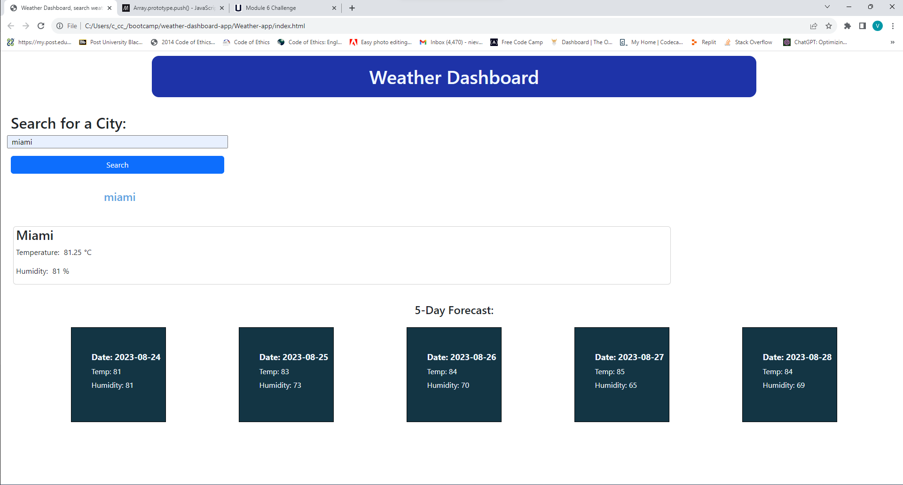

 Weather Wizard

Welcome to Weather App, a web application that provides real-time weather information for cities around the world. With Weather App, users can retrieve current weather data and a five-day forecast by entering the name of a city. The application is built using HTML, CSS, Bootstrap, and JavaScript, and it integrates with the OpenWeather API to fetch weather data.



## Features

- **Current Weather:** Get real-time weather information, including temperature, humidity, and weather conditions, for the entered city.
- **Five-Day Forecast:** View a detailed forecast for the next five days, including maximum and minimum temperatures, and weather conditions.
- **Responsive Design:** Enjoy a seamless experience on a variety of devices, from desktop to mobile.

## Technologies

- HTML
- CSS
- Bootstrap
- JavaScript

## Getting Started

1. Clone the repository: `git clone https://
2. Navigate to the project directory: `cd weather-app`
3. Open `index.html` in your preferred web browser.

## Usage

1. Enter the name of a city in the search box.
2. Click the "Search" button.
3. The current weather for the entered city will be displayed, along with a five-day forecast.

## API Integration

Weather App integrates with the OpenWeather API to fetch weather data. To set up the API integration:

1. Sign up for an API key from [OpenWeather](https://openweathermap.org/api).
2. Open the `script.js` file and replace `YOUR_API_KEY` with your actual API key.

Important: Keep your API key secure and do not share it publicly in your code or repository.

```javascript
const apiKey = "322bh7d6844fb9fhe3d7aha3dbah2185";
Important: This is just a placeholder example. Make sure to use your own valid API key.

## Live Demo
Check out the live version of the Weather Wizard:
[Weather Wizard Live Demo](https:pc-vic.github.io/Weather-Wizard)

## Contact

If you have any questions, suggestions, or feedback about the Weather App, feel free to reach out:

- Email: nievesvic86@gmail.com
- GitHub: [PC-Vic](https:github.com/PC-Vic)

We appreciate your interest and input!